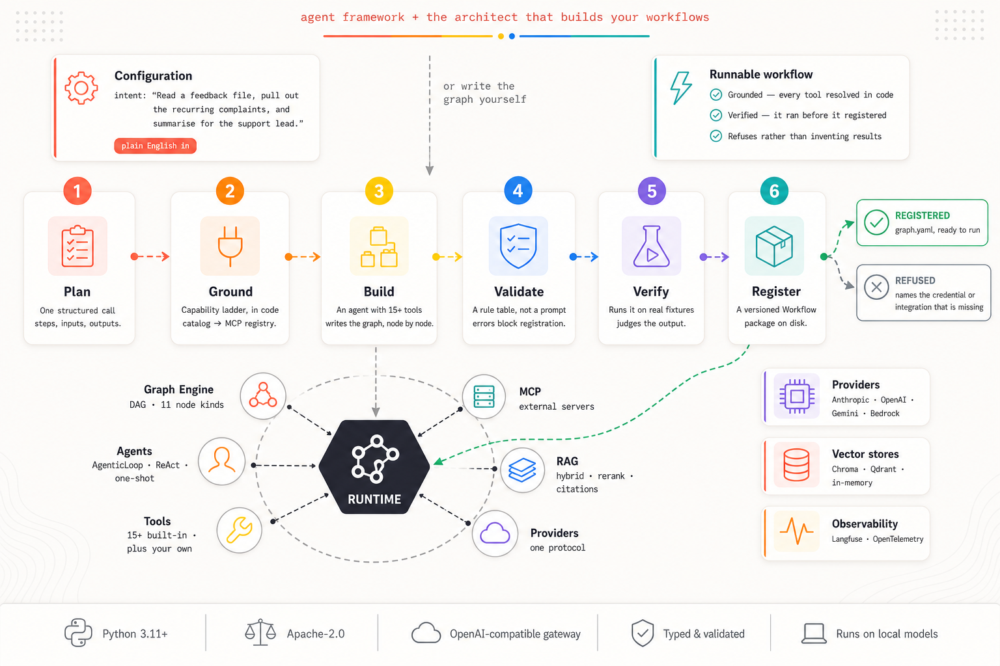

# Architecture

Neurosurfer is a set of layers you can adopt independently. Use a bare provider for one call, an
agent for multi-step tool use, a graph for orchestration, or the gateway to serve any of them behind
an OpenAI-compatible API.

## The picture

{ .architecture-diagram }

Two ways in. Along the top, the **Architect** turns a plain-English intent into a workflow —
planning it, grounding every capability against what actually exists, building it, validating it,
**running** it, and either registering it or refusing and naming what is missing. Below, the
**runtime** it hands that workflow to: the graph engine, the agents, and the tools, MCP servers and
retrieval they draw on. The second arrow into the runtime is the other door — writing the graph
yourself and skipping the Architect entirely.

## The layers

- **Providers** ([`neurosurfer.llm`](../guides/providers.md)) normalise every model behind one
  `Provider` protocol and a canonical message/response model, so nothing above cares which vendor you
  use.
- **Agents** ([`neurosurfer.agents`](../guides/agents.md)) turn a provider + tools into a run loop
  that streams typed events, gates dangerous actions, and manages the context window.
- **Tools** ([`neurosurfer.tools`](../guides/tools.md)) are what an agent can *do* — file ops, shell,
  web search, sandboxed Python, HTTP, browser, SQL — plus [MCP](../guides/mcp.md) tools from
  external servers.
- **The registry** ([`neurosurfer.registry`](../guides/tool-registry.md)) is what makes those tools
  *findable*: each declares a capability tag from a closed vocabulary, so a need resolves against a
  declaration rather than against words a description happens to share.
- **RAG** ([`neurosurfer.rag`](../guides/rag.md)) adds ingest → chunk → embed → retrieve with
  token-aware context injection, backed by pluggable vector stores.
- **Orchestration** ([`neurosurfer.graph`](../graph/index.md)) runs multi-node DAGs of functions,
  tools, and agents — with branching, loops, fan-out, and a validation gate that refuses a graph
  before a model is called.
- **Authoring** ([`neurosurfer.architect`](../architect/index.md)) designs those graphs from a
  plain-English description, grounds every capability it names against the registry, and proves its
  work by running it. The runtime never imports the authoring layer.
- **Gateway** ([`neurosurfer.app.server`](../server/index.md)) exposes any of the above as a model at
  `/v1/chat/completions`, with SSE streaming, upstream proxying, and request/response hooks — plus
  the [workflow](../server/workflows-api.md) and [architect](../server/architect-api.md) APIs.
- **Observability** ([`neurosurfer.observability`](../observability/index.md)) is a cross-cutting
  layer: every agent run emits a trace to Langfuse or any OTLP backend with **zero code change**.

## How a request flows

1. You build a **provider** (from env/profile) and a **tool pool**.
2. You construct an **agent** and call `run(prompt)` — an async generator of
   [events](concepts.md#events).
3. Each turn the agent streams the model, and on tool calls it **gates** them through guardrails and
   the `io` handler, executes, and feeds results back — until the model finishes.
4. If tracing is enabled, a side-channel observer maps those events to a trace **without touching**
   the agent.
5. Behind the gateway, that same run is wrapped as an OpenAI `/v1/chat/completions` response.

See [Core Concepts](concepts.md) for the canonical types and the event lifecycle, and
[Permissions & Safety](permissions.md) for how gating works.
