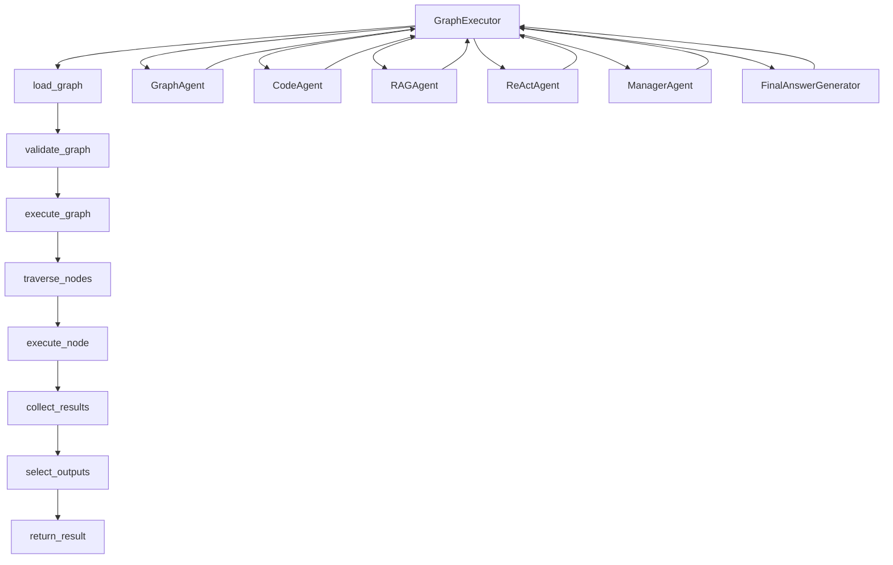

# Node `finalize_docs` output

- Mode: `text`
- Started at: `2026-01-04T12:09:51.777233`
- Duration: `17903` ms
- Error: `None`

---

# GraphExecutor Module Documentation

## Overview
The `GraphExecutor` module is used for executing graph-based workflows in the Neurosurfer framework. It manages the execution of graph structures, validates configurations, and collects results.

## Responsibilities & Non-goals
- **Responsibilities:**
  - Execute graph-based workflows.
  - Validate graph configurations.
  - Collect and return execution results.
- **Non-goals:**
  - Not responsible for UI or external API integrations.
  - Not responsible for data storage or retrieval.

## Key Types / Functions
- `GraphExecutor`: Core class for executing graph-based workflows.
- `GraphAgent`: Agent that uses `GraphExecutor` for managing graph-based workflows.
- `CodeAgent`: Specialized agent for multi-step code execution using `GraphExecutor`.
- `RAGAgent`: Agent that uses `GraphExecutor` for graph-based tasks in retrieval-augmented generation.
- `ReActAgent`: Base class for agents that use `GraphExecutor` for managing workflows.
- `Graph`: Graph structure representing a workflow.
- `GraphNode`: Individual node in a graph-based workflow.
- `GraphInput`: Input data for a graph-based workflow.
- `GraphExecutionResult`: Result of graph execution, containing outputs and metadata.

## Call Flow
- `GraphExecutor` is invoked by agents like `GraphAgent`, `CodeAgent`, `RAGAgent`, and `ReActAgent`.
- The execution process begins with loading a graph structure using `load_graph`.
- The graph is validated for configuration (e.g., checking for cycles, dependencies).
- The graph is executed by traversing nodes in topological order.
- Each node's associated tool or logic is executed, and results are collected.
- The final outputs are selected based on the graph's defined outputs or the last node in topological order.
- Results are returned as a `GraphExecutionResult` object.

## Mermaid Diagram


## Usage Examples
- ```python
  from neurosurfer.agents.graph.executor import GraphExecutor
  executor = GraphExecutor()
  result = executor.execute_graph("example_graph")
  ```
  *Note: Pseudo-code. Real usage may vary based on graph configuration.*

- ```python
  from neurosurfer.agents.graph.loader import load_graph
  graph = load_graph("example_graph.json")
  ```
  *Note: Real usage. Loads a graph from a JSON file.*

- ```python
  from neurosurfer.agents.graph.schema import Graph
  graph = Graph(nodes=[node1, node2], edges=[edge1, edge2])
  ```
  *Note: Pseudo-code. Real usage may vary based on graph configuration.*

## Gotchas / Edge Cases
- Ensure graph configurations are valid to avoid `GraphConfigurationError`.
- Handle exceptions like `GraphExecutionError` and `NodeExecutionError` during execution.
- Validate inputs before execution to prevent `ValidationError`.

## Next improvements
- Investigate the actual implementation of `GraphExecutor` to confirm its responsibilities.
- Verify the integration of `GraphExecutor` with agents like `GraphAgent` and `CodeAgent`.
- Explore the use of `GraphExecutor` in real-world scenarios to understand its full capabilities.