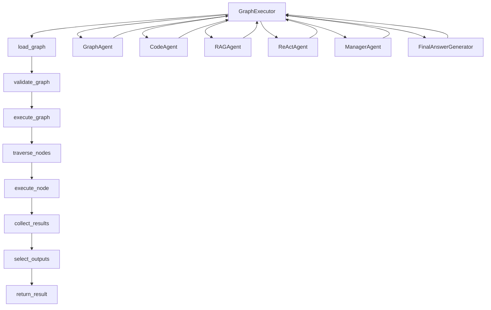

# Node `generate_mermaid_diagram` output

- Mode: `text`
- Started at: `2026-01-04T12:09:09.957317`
- Duration: `3697` ms
- Error: `None`

---

```mermaid
graph TD
    A[GraphExecutor] --> B[load_graph]
    B --> C[validate_graph]
    C --> D[execute_graph]
    D --> E[traverse_nodes]
    E --> F[execute_node]
    F --> G[collect_results]
    G --> H[select_outputs]
    H --> I[return_result]
    A --> J[GraphAgent]
    A --> K[CodeAgent]
    A --> L[RAGAgent]
    A --> M[ReActAgent]
    A --> N[ManagerAgent]
    A --> O[FinalAnswerGenerator]
    J --> A
    K --> A
    L --> A
    M --> A
    N --> A
    O --> A
```